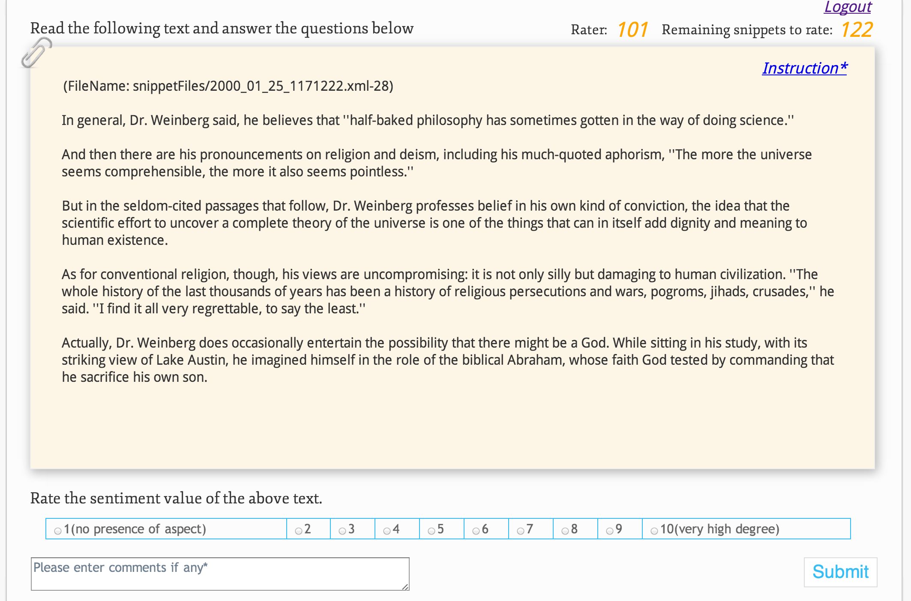
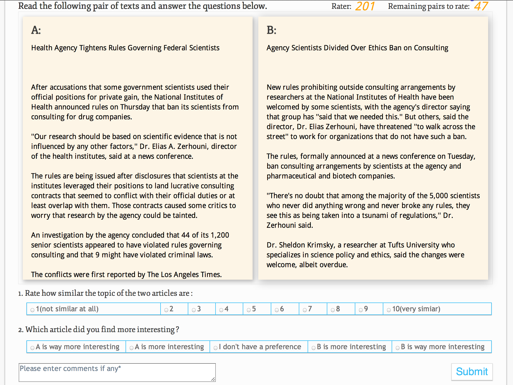

Wallstreet Journal Crowdsourcing Website
========================================

A website in PHP and MySQL analyzing people's interest on The Wall Street Journals aiming to enhance the text quality of opinion mining. This helped win 2012 Google Best Paper Award. 
Please visit to [http://penn-annotation.co.nf](http://penn-annotation.co.nf)
## _About_
* Task: An annotation tool for WSJ
* Author: Yayang Tian
* Advisor: Dr. Annie Louis, Prof. Ani Nenkova
* Language: PHP, MySQL, HTML, CSS
* Corpus: Wall Street Journals
* URL:  [http://penn-annotation.co.nf](http://penn-annotation.co.nf)

## _How to run_
* THe annotation work was done in December 2013, so please feel free to try : )
<table>
<tr><th>Key</th><th>Password</th><th>Function</th></tr>
<tr><td>101</td><td>nlp</td><td>Aspect rating</td></tr>
<tr><td>201</td><td>nlp</td><td>Pairwise rating</td></tr>
<tr><td>Yayang</td><td>Yayang</td><td>Manager page</td></tr>
</table>

## _Snapshots_

### _Main snapshots_
1. Aspect ratings: The first task was to give overall impression for sentiment level in terms of aspect "Animacy, Interest, Narrative, Negative Emotions, Polarity, Research, or Visual". Different annotators were assigned to different aspects.

2. Pairwise ratings: The second task was to compare two paragrah 

### _Additional snapshots_

