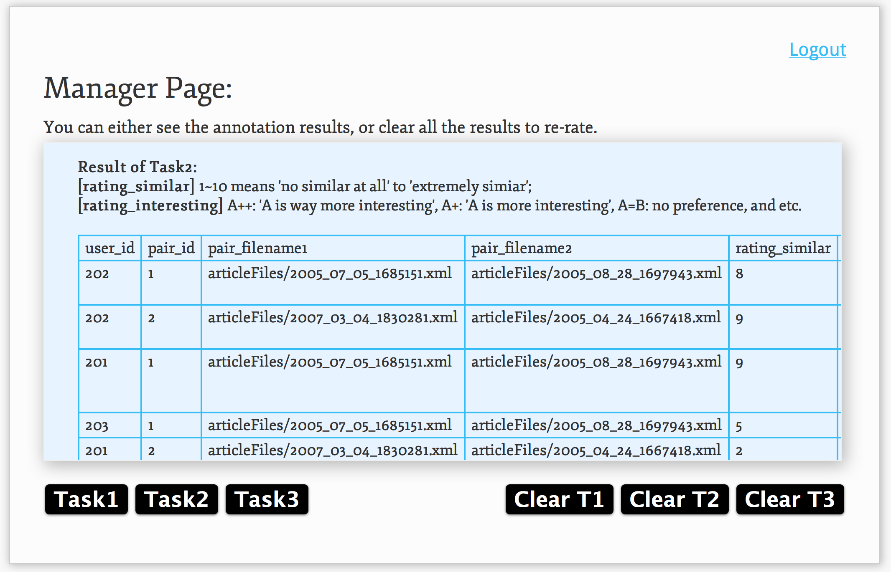
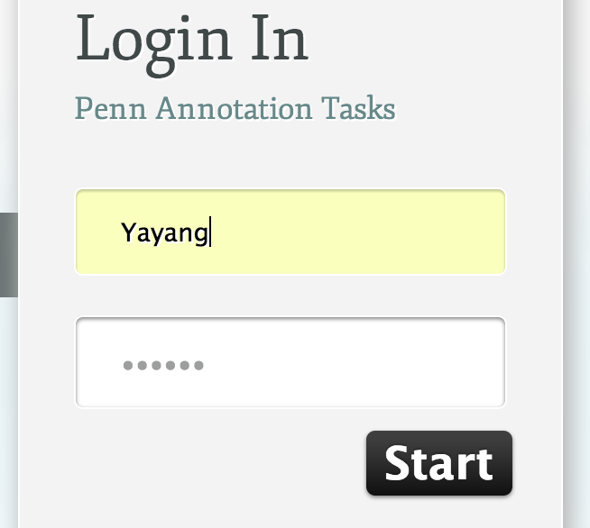
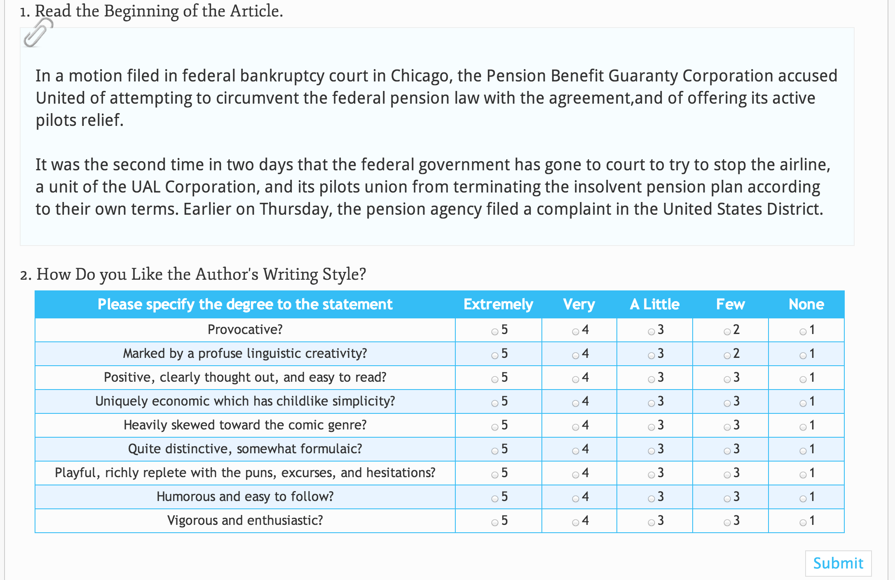
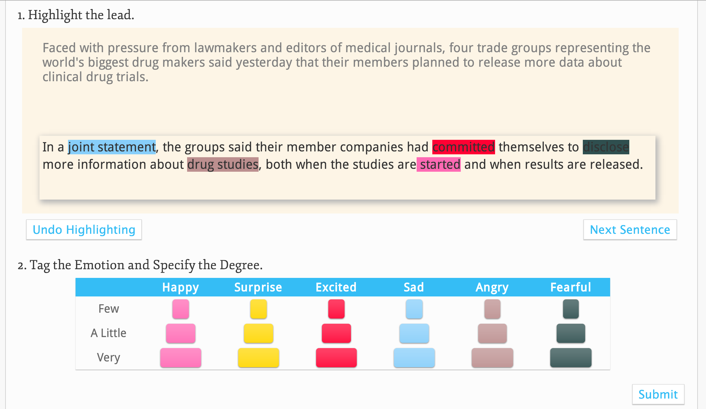
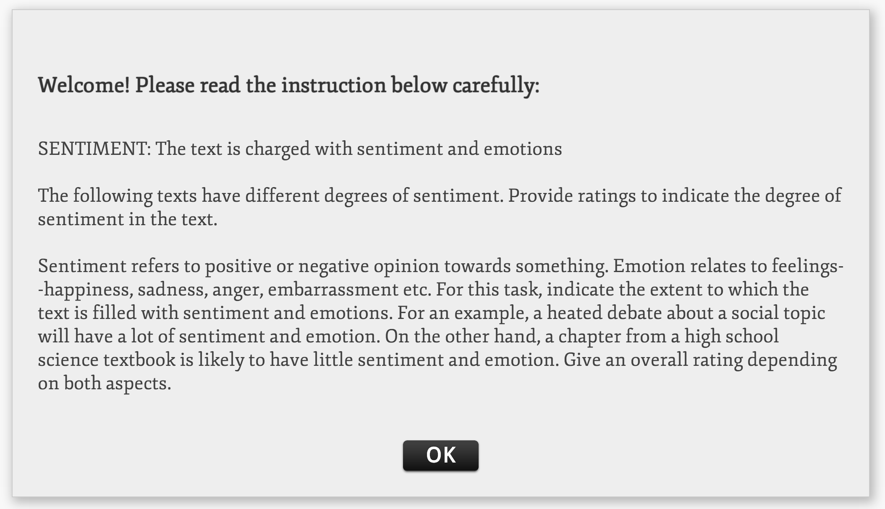
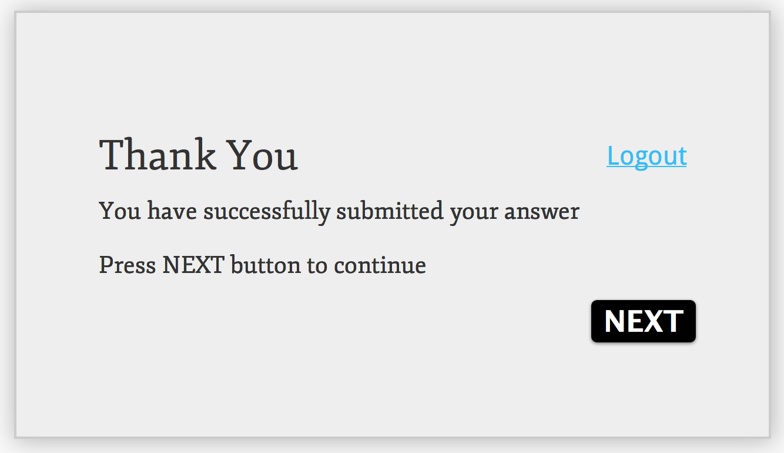

Wallstreet Journal Crowdsourcing Website
========================================

A website in PHP and MySQL analyzing people's interest on The Wall Street Journals aiming to enhance the text quality of opinion mining. This helped win 2012 Google Best Paper Award. 
Please visit to [http://penn-annotation.co.nf](http://penn-annotation.co.nf)
## _About_
* Task: An annotation tool for WSJ
* Author: Yayang Tian
* Advisor: Dr. Annie Louis, Prof. Ani Nenkova
* Language: PHP, MySQL, HTML, CSS (I implemented the whole website from scratch)
* Corpus: Wall Street Journals
* URL:  [http://penn-annotation.co.nf](http://penn-annotation.co.nf)

## _How to run_
* THe annotation work was done in December 2013, so please feel free to try : )
<table>
<tr><th>Key</th><th>Password</th><th>Function</th></tr>
<tr><td>101</td><td>nlp</td><td>Aspect rating</td></tr>
<tr><td>201</td><td>nlp</td><td>Pairwise rating</td></tr>
<tr><td>Yayang</td><td>Yayang</td><td>Manager page</td></tr>
</table>

## _Snapshots_

### _Main snapshots_
1. Aspect ratings: The first task was to give overall impression for sentiment level in terms of aspect "Animacy, Interest, Narrative, Negative Emotions, Polarity, Research, or Visual". Different annotators were assigned to different aspects.

2. Pairwise ratings: The second task was to compare two paragrah side by side and specify degree of similarity and interest.

3. Manager page: The manager page was basically basic database interaction - researchers could see the annotation results, clear task, and re-annotate.

### _Additional snapshots_
1. Login:

2. Answer questions: Answer question about perceptions of headlines:

3. Highlighting: 

Highlight the degree of sentiments.

4 Instruction for sentiment analysis:

5. Thank you page:

